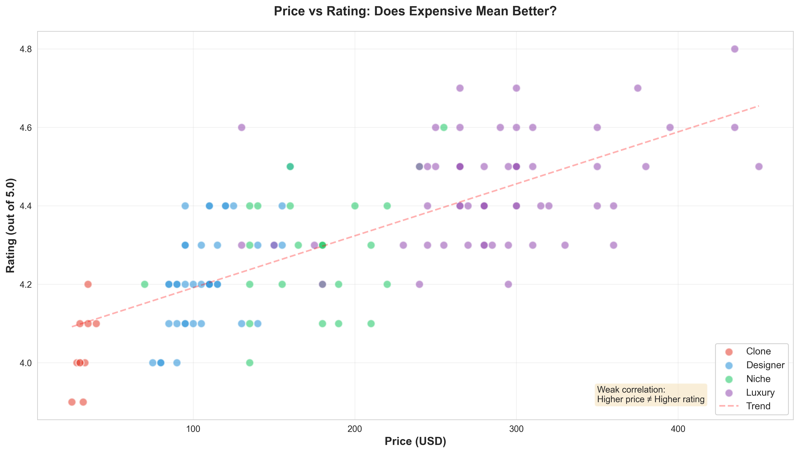
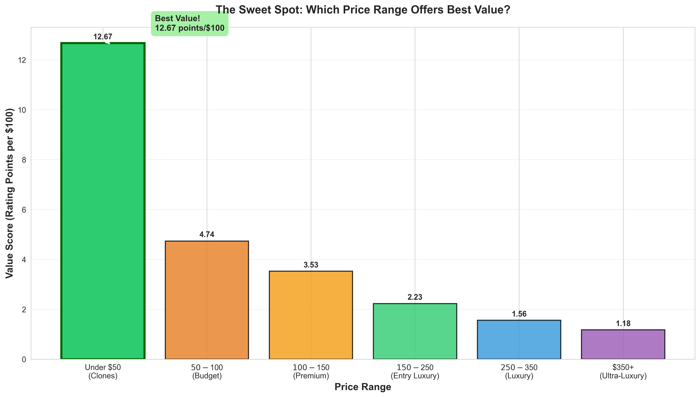
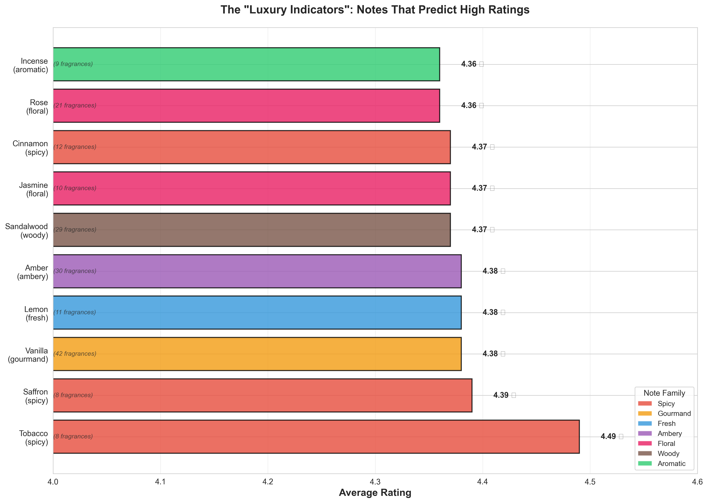

# 🌸 Fragrance Market Analysis - SQL Project

A data-driven analysis of 132 fragrances across designer, niche, luxury, and clone categories using SQL and Python.

## 📊 Project Overview

This project analyzes fragrance ratings, pricing, and scent profiles to uncover insights about the fragrance market. Using SQL queries and data analysis, I explored what makes fragrances successful and how consumers can make informed purchasing decisions.

**Dataset:** 132 fragrances | 195 unique scent notes | 19 note families

**Data Sources:** Fragrantica, Basenotes, and various fragrance retailers (prices standardized to 100ml bottles, February 2025)

## 🎯 Key Insights

### 💰 The Price-Quality Sweet Spot
- **Best value range:** $100-$150 (4.26 avg rating)
- **Designer fragrances** offer 3.91x better value per dollar than luxury
- **Ultra-luxury** ($350+) only improves ratings by 0.28 stars

## 📊 Visual Analysis

### Price vs Rating: Does Expensive Mean Better?


**Key Finding:** Weak correlation between price and rating. Many affordable fragrances ($100-150) rate just as highly as ultra-luxury options ($350+).

### The Sweet Spot: Value Score by Price Range


**Key Finding:** The $100-$150 range delivers 3.91 rating points per $100 spent - the best value in the market.

### Luxury Indicators: Notes That Predict High Ratings


**Key Finding:** Fragrances containing tobacco, saffron, and vanilla average 4.4+ stars, regardless of price point.

---

### 🔬 The "Luxury Indicators"
Notes that predict high ratings:
1. **Tobacco** (4.49 avg) - $247 avg price
2. **Saffron** (4.39 avg) - $234 avg price  
3. **Vanilla** (4.38 avg) - appears in 42 fragrances
4. **Amber** (4.38 avg) - $224 avg price

### 💎 Hidden Gems (4.3+ Rating Under $150)
| Fragrance | Brand | Price | Rating |
|-----------|-------|-------|--------|
| La Nuit de l'Homme | YSL | $95 | 4.4 |
| Prada L'Homme Intense | Prada | $95 | 4.3 |
| Acqua di Gio Profumo | Armani | $110 | 4.4 |
| Le Male Elixir | JPG | $110 | 4.4 |
| Dior Sauvage | Dior | $120 | 4.4 |

### 🧪 Clone vs Original Analysis
- **Average clone price:** $32
- **Average designer price:** $108
- **Savings:** $77 (71% less)
- **Rating difference:** Only 0.19 stars

**Conclusion:** Clones offer 96% of the quality at 30% of the price.

### 🏆 Best Performing Brands (3+ fragrances)
1. **Roja Dove** - 4.65 avg rating ($389 avg)
2. **Xerjoff** - 4.50 avg rating ($265 avg)
3. **Killian** - 4.50 avg rating ($269 avg)
4. **Dior** - 4.41 avg rating ($199 avg) ⭐ **Best value**

### 📦 The Data-Driven 10-Fragrance Collection

Based on maximizing scent diversity while balancing cost and ratings:

**Total Investment:** $2,465 | **Average Rating:** 4.58/5.0

1. Sauvage Elixir (Dior) - $160
2. Dior Sauvage (Dior) - $120  
3. Dior Homme Parfum (Dior) - $155
4. Portrait of a Lady (Frederic Malle) - $255
5. Thé Noir 29 (Le Labo) - $240
6. Tam Dao (Diptyque) - $160
7. Enigma (Roja Dove) - $435
8. Elysium (Roja Dove) - $375
9. Baccarat Rouge 540 (MFK) - $300
10. Angel's Share (Killian) - $265

## 🛠️ Technical Implementation

### Database Schema
```sql
-- Three-table normalized structure
CREATE TABLE fragrances (
    fragrance_id INTEGER PRIMARY KEY,
    name TEXT,
    brand TEXT,
    price_usd REAL,
    category TEXT,
    rating REAL
);

CREATE TABLE notes (
    note_id INTEGER PRIMARY KEY,
    note_name TEXT,
    note_family TEXT
);

CREATE TABLE fragrance_notes (
    fragrance_id INTEGER,
    note_id INTEGER,
    position TEXT, -- top/middle/base
    FOREIGN KEY (fragrance_id) REFERENCES fragrances(fragrance_id),
    FOREIGN KEY (note_id) REFERENCES notes(note_id)
);
```

### Technologies Used
- **SQLite** - Database management
- **Python** - Data analysis and querying
- **Pandas** - Data manipulation
- **SQL** - Complex queries with JOINs, aggregations, CTEs

### Sample Queries

**Most common note combinations in top-rated fragrances:**
```sql
SELECT n1.note_name, n2.note_name, COUNT(*) as frequency
FROM fragrances f
JOIN fragrance_notes fn1 ON f.fragrance_id = fn1.fragrance_id
JOIN fragrance_notes fn2 ON f.fragrance_id = fn2.fragrance_id
JOIN notes n1 ON fn1.note_id = n1.note_id
JOIN notes n2 ON fn2.note_id = n2.note_id
WHERE f.rating >= 4.5 AND n1.note_id < n2.note_id
GROUP BY n1.note_name, n2.note_name
ORDER BY frequency DESC;
```

## 📁 Project Structure
```
fragrance-sql-project/
├── fragrances.db           # SQLite database
├── fragrances.csv          # Raw fragrance data
├── notes.csv               # Scent notes reference
├── fragrance_notes.csv     # Many-to-many relationship
├── create_database.py      # Database schema creation
├── import_data.py          # Data import script
├── queries.py              # Basic analysis queries
├── advanced_queries.py     # Complex analysis
├── linkedin_insights.py    # Key insights for sharing
└── README.md               # This file
```

## 🚀 How to Run

1. **Clone the repository**
```bash
git clone https://github.com/YOUR_USERNAME/fragrance-analysis.git
cd fragrance-analysis
```

2. **Set up environment**
```bash
python -m venv venv
source venv/bin/activate  # On Windows: venv\Scripts\activate
pip install -r requirements.txt
```

3. **Run analysis**
```bash
python advanced_queries.py
python linkedin_insights.py
```

## 📈 Future Enhancements

- [ ] Add seasonal recommendations (spring/summer/fall/winter)
- [ ] Include gender classification (masculine/feminine/unisex)
- [ ] Expand dataset to 200+ fragrances
- [ ] Add longevity and projection metrics
- [ ] Create interactive Tableau/PowerBI dashboard
- [ ] Web scraping automation (when feasible)

## 🤝 Contributing

This is a personal portfolio project, but suggestions are welcome! Feel free to open an issue or submit a pull request.

## 📧 Contact

**Maumin Touqeer** - [LinkedIn](https://linkedin.com/in/maumintouqeer/) | [Email](mailto:mauminct@gmail.com
)

## 📄 License

This project is open source and available under the [MIT License](LICENSE).

---

⭐ If you found this analysis helpful, please star the repository!